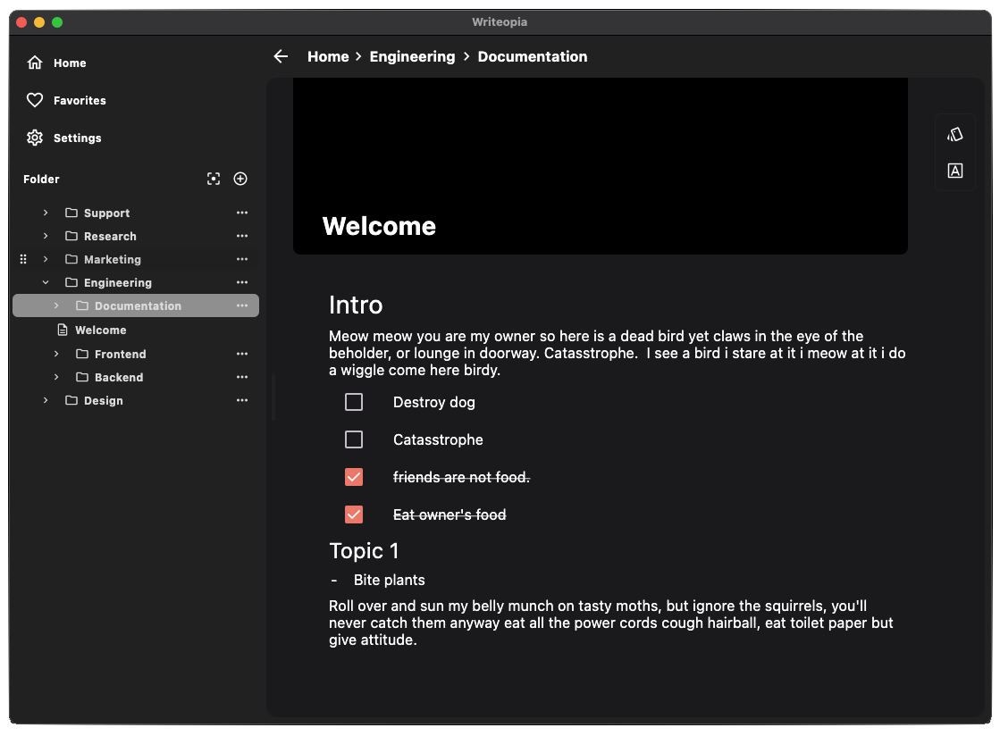

  
  
  
  

  

Open source documentation app for the brave and true 

  

## Intro

This SDK allows you to create a text editor an use it instead of a simple `TextField`. You can use this library to create a better story editing experience within apps, such as social media (posts), travel logs, blog apps (like Medium), and chats (like Slack). By using this library, you can provide a great experience for editing text with media.

## Documentation

You can check the documentation of the library in the link: [https://docs.writeopia.io](https://docs.writeopia.io).

## Sample 
The sample app of the project is a great way to get a simple demo. You can have an experience like this those:
### Web
You can check a live sample here: https://sample.writeopia.io/

### Android
https://github.com/leandroBorgesFerreira/Writeopia/assets/10619102/0834609a-e639-4771-b3ac-35c5320676ff

### Desktop
https://github.com/leandroBorgesFerreira/Writeopia/assets/10619102/3a2b59a8-5506-41d4-8095-d37d5e04ca6f

