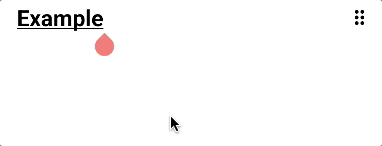

# Command Samples
Writeopia handles many text commands that create new content from what the user types. In this section you will learn the built-in commands.

## Checkbox
Typing the command  `-[] ` creates a checkbox in the place of current paragraph. The command must be done at the beginning of the line. 

## List item
Typing the command  `- ` creates a list item in the place of current paragraph. The command must be done at the beginning of the line. 

## H1, H2, H3, H4
Writeopia also has commands to create H1, H2, H3 and H4.

| Command | Result  |
| ------- | ------- | 
| `#`     | H1      |
| `##`    | H2      |
| `###`   | H3      |
| `####`  | H4      |

H3 sample: 

