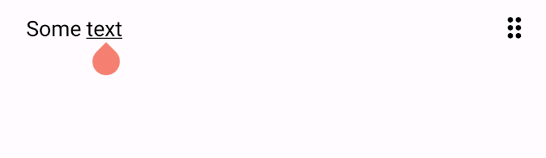

# Basics


Add the project in your gradle file:

```kotlin
implementation("com.github.leandroborgesferreira:storyteller-models:[version]")
implementation("com.github.leandroborgesferreira:storyteller:[version]")
```

Check releases for [latest](https://github.com/leandroBorgesFerreira/StoriesTeller/releases) version.

## Configuration

Before displaying the content on the screen. It is necessary to configure `StoriesTellerManager` which controls the state of the content, the `Drawer`s which are the classes responsible for each component of the edit and `StoriesTellerEditor` which is the Composable responsible for drawing the whole editor on the screen.

## StoriesTellerManager

The class `StoriesTellerManager` accepts many parameters, which will be covered in a different section, but you can simply call the constructor to have the default behavior:

```kotlin
@Composable
fun storiesTellerSample() {
  StoriesTellerManager()
}
```

## Drawers

Each part of the text edition is drawn by the `StoryStepDrawer`. This interface has the logic to draw one type of information from the text. There are many drawers already implemented and available in the `DefaultDrawers` factory. Provide the `StoriesTellerManager` for the default behavior:

```kotlin
DefaultDrawers.create(
  manager = noteEditorViewModel.storiesTellerManager 
)
```

## Display content

The `Composable` responsible for drawing the text editor is `StoryTellerEditor`. It needs at least a map with Drawers, the`StoriesTellerManager` and a `DrawState` to draw.

```kotlin
@Composable
fun storiesTellerSample() {
  val drawState = DrawState(
    stories = mapOf(
      0 to DrawStory(
        StoryStep(type = "message", text = "Some text"),
        isSelected = false
      ),
    )
  )
  
  StoriesTellerEditor(
    modifier = Modifier.fillMaxWidth().weight(1F),
    storyState = drawState,
    drawers = DefaultDrawers.create(
      manager = StoriesTellerManager()
    )
  )
}
```

The above code should display a simple message on the screen and you should be able to interact with the text editor.


